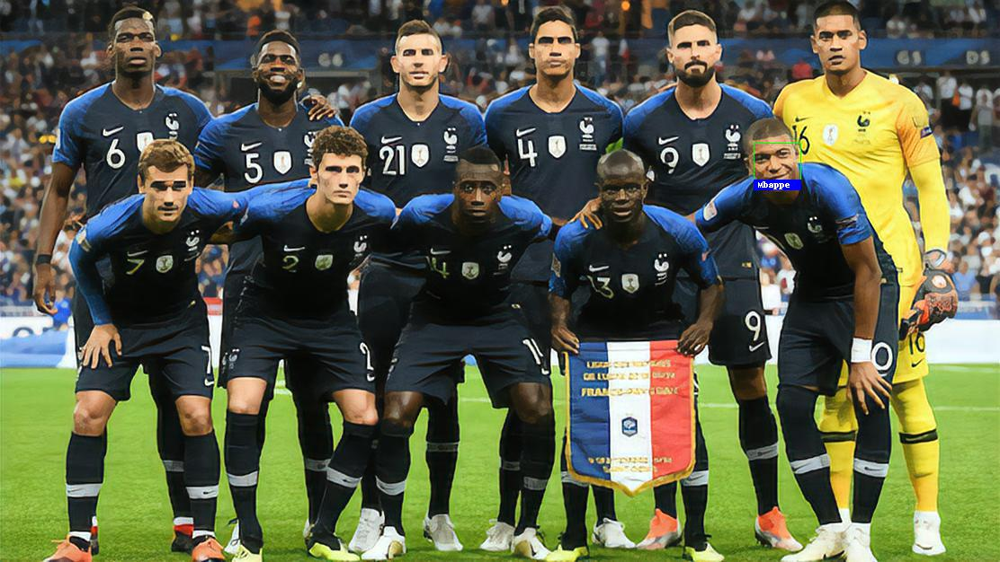

# Upscale a French Soccer Team image and Identify Mbappe in the picture

Use pre-trained models to upscale a football team picture and detect a special player in this upscaled picture

This repository only contains an ipynb file and all the pictures needed in order to run it.

*Requirements :*

* pip install ISR

* pip install face_recognition

You can directly try it on Google Colab, just follow this link and remember to upload all the pictures in the right folder : 

https://colab.research.google.com/drive/1BAGSPGwcSN0lXUDnV7FTSdE1EA50zJkB

Here is the final result of the script : 

